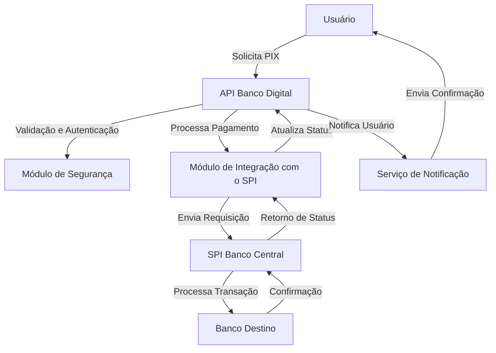

# Integração de um Banco Digital para Transações PIX

## 1. Estrutura de Integração

A integração do banco digital para transações PIX visa conectar os sistemas internos da instituição financeira com o Banco Central e outras instituições financeiras. Essa integração deve garantir conformidade com padrões de segurança, desempenho e confiabilidade, conforme os requisitos da norma ISO/IEC 25010.

### 1.1 Requisitos Funcionais e Não Funcionais

De acordo com a ISO/IEC 25010, os seguintes requisitos são considerados:

#### **Requisitos Funcionais:**
- Realização de transferências PIX entre contas.
- Consulta de status de transação em tempo real.
- Notificação de sucesso ou falha ao usuário.
- Registro de logs para auditoria.

#### **Requisitos Não Funcionais:**
- **Desempenho**: Tempo de resposta máximo de 5 segundos para transferências.
- **Segurança**: Uso de criptografia TLS 1.3 e autenticação OAuth 2.0.
- **Disponibilidade**: SLA de 99,9% de uptime.
- **Manutenibilidade**: APIs versionadas e documentadas.

### 1.2 Serviços da Integração

A arquitetura de integração é composta pelos seguintes serviços:

- **API Banco Digital**: Responsável por receber solicitações de transferências, validar os dados e encaminhar as requisições ao sistema interno.
- **Módulo de Segurança**: Realiza autenticação e validação das transações, garantindo conformidade com os padrões de segurança.
- **Módulo de Integração com o SPI**: Intermedia a comunicação entre o banco digital e o Sistema de Pagamentos Instantâneos (SPI) do Banco Central.
- **SPI Banco Central**: Sistema oficial do Banco Central que processa e valida as transações PIX.
- **Banco Destino**: Instituição financeira que recebe e processa os valores transferidos.
- **Serviço de Notificação**: Responsável por enviar confirmações e alertas ao usuário sobre o status da transação.

### 1.3 Diagrama de Integração

## 2. Controle de Qualidade da Integração

### 2.1 Documentação do Controle de Qualidade

O controle de qualidade da integração deve garantir conformidade com os seguintes critérios:
- **Protocolos**: Implementação de TLS 1.3 para segurança da comunicação.
- **Versionamento**: Controle de versões de API para compatibilidade futura.
- **Tempos de Resposta**:
  - Tempo médio de resposta esperado: <1s.
  - Tempo máximo permitido: 5s.
- **Tratamento de Exceções**:
  - Reprocessamento automático em caso de falha de comunicação.
  - Notificação de erro ao usuário em caso de falha irreversível.

### 2.2 Codificação do Controle de Qualidade

Para garantir a qualidade da integração, as seguintes medidas devem ser implementadas:

- **Testes Automatizados**: Execução de testes unitários e de integração para validar a comunicação entre os módulos.
- **Monitoramento Contínuo**: Uso de ferramentas para rastreamento de falhas e métricas de desempenho.
- **Auditoria e Logging**: Registro detalhado de todas as transações para rastreamento e conformidade regulatória.
- **Fallback e Retentativas**: Implementação de lógica para retentativas automáticas em casos de falha temporária na comunicação com o SPI.

## Conclusão

O documento apresenta a estrutura de integração de um banco digital para transações PIX, destacando requisitos funcionais e não funcionais conforme a ISO/IEC 25010. Também são detalhados os serviços envolvidos, um diagrama de fluxo e os principais aspectos do controle de qualidade, garantindo segurança, desempenho e disponibilidade.

